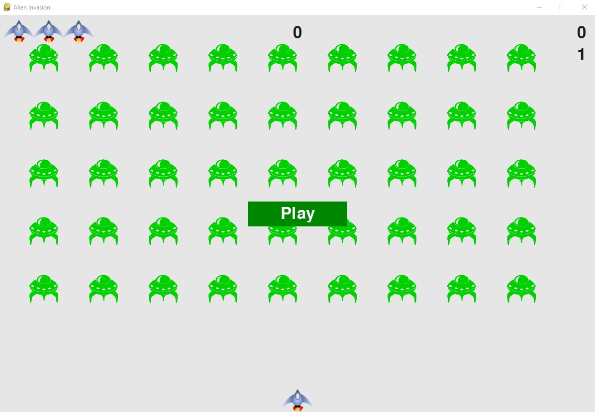

# Python Crash Course
Python Crash Course, 3nd Edition, Eric Matthes © 2023 by No Starch Press

 - Part 1 - Basics
   - Chapters 1-11 teach the basics of Python programming, from installing Python, creating and working with variables, conditional statements, lists/dicts/tuples, user-input, for and while loops, and utilizing everything in functions and classes. Finishing part 1, you work with files and error-handling and a brief chapter on testing.

 - Part 2 - Projects
   - Alien Invasion  
    <table>
        <tr>
            <td width="20%">
                
            </td>
            <td>
                

                    - In chapters 12-14, you utilize pygame to create a 'Space Invaders' style game. The book has you start with a simple screen displayed, then adding an image, some movement with keyboard, and on to collisions and scoring. After every small functional step, the book asks you to run the game (with altered settings for time efficiency) and make sure everything is working as planned. There is a lot of refactoring as new features get implemented, new modules created and imported, and docstrings in each class and method.  
                     
                    Overall, I really liked the small refactoring steps and the repetition of how features were added, as it had me anticipating what I needed to do in the steps that followed.
                

            </td>
        </tr>
    </table>